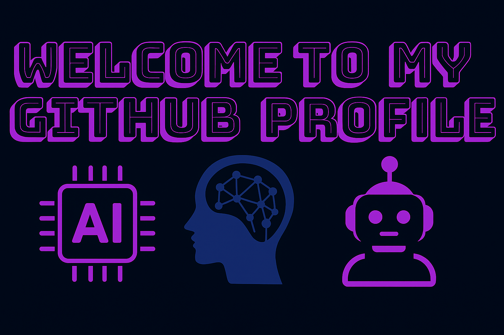

# 👋 Hi, I’m Levan Dalbashvili
I’m a **AI & Data Engineer** and **Full-Stack Developer** with a strong passion for **Machine Learning & Artificial Intelligence** and problem-solving. My background blends **Software Engineering**, **Machine Learning**, and **Data Engineering**, with hands-on experience building production-ready applications and AI systems.

---

## 🌐 Socials
 

---

## 💻 Tech Stack
**Languages & Frameworks**          
**Web & Mobile**        
**Databases**      
**AI, Data & Tools**      

---

## 🚀 Featured Projects
- **Chess Chain** – Ethereum wallet integration, transactions, cryptographic signatures, Merkle Trees, Ed25519.
- **Magnus Chess AI** – Deep learning chess AI with PyTorch, MLflow, DVC, and chess engines.
- **Facial Recognition App** – Built with Python, OpenCV, TensorFlow, and Siamese networks.
- **Galactic Conquest Game** – Multiplayer 2D interactive game using Next.js, Pixi.js, WebSocket, Redis, PostgreSQL, and Docker.
- **Ecommerce Website** – React, TypeScript, API, Material UI, Context API, JWT, and Vite.
- **Fantasy.Space Game Backend** – Kotlin, Spring Boot, JPA, H2 Database.

---
## 📊 GitHub Stats

---

